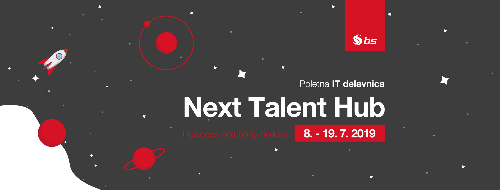

</img>

# Bs Teams and Power Bi websites

These two concept websites were built during a 2 week tech workshop ([Next Talent Hub](https://www.talenthub.si/)) at [Business Solutions d.o.o.](https://www.b-s.si/si-si/homepage/). 
Source code for [Microsoft Teams](https://products.office.com/sl-si/microsoft-teams/group-chat-software) website is located on the [main branch](https://github.com/jakic12/bs-teams/tree/master), while source code for [Microsoft PowerBi](https://powerbi.microsoft.com/en-us/) website is located on [master-pb](https://github.com/jakic12/bs-teams/tree/master-pb) branch.

## In the news
- [Racunalniske Novice](https://www.racunalniske-novice.com/novice/sporocila-za-javnost/z-delavnico-next-talent-hub-do-kljucnih-kompetenc-za-uspesno-kariero.html)
- [Radio Koper](https://www.rtvslo.si/radiokoper/novice/next-talent-hub-od-ideje-do-koncnega-izdelka/494066)
- [Tovarna Finance](https://tovarna.finance.si/8950856)

## Team
- [Aljaz Krpan](https://github.com/alkr11)
- [Jakob Drusany](https://github.com/jakic12)
- [Bartolomej Kozorog](https://github.com/bartolomej)
- [Luka Gulic](https://github.com/GulicLuka)
- [Jan Kersevan](https://github.com/JanKerso)
- Julija Cerne
- Andraz Filej
- Matej Cerne
- Miha Pahor

## Mentors
- Jernej Rehar (director)
- Matej Černe (developer)
- Elvis Sukanović (developer)
- Tina Zgaga (marketing manager)
- Iztok Pavlin (project manager)
- Nejc Fabjan (data analyst)
- Dean Podgornik (developer)

## Available Scripts

In the project directory, you can run:

#### `npm start`

Runs the app in the development mode. 
Open [http://localhost:3000](http://localhost:3000) to view it in the browser.

#### `npm run build`

Builds the app for production to the `build` folder. 
It correctly bundles React in production mode and optimizes the build for the best performance.
